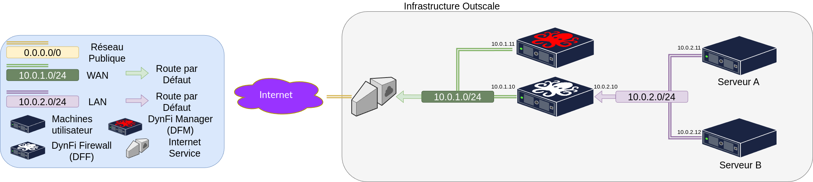

# DynFi Firewall and DynFi Manager over the Outscale cloud

This project uses the AWS API to provision DynFi Firewall and DynFi Manager over the Outscale cloud.
It serves as a Proof Of Concept to teach basic usage of our solutions.

Here is the infrastructure that is built:



# How to use it

## Prerequisites

Before continuing, please make sure you have an Outscale account, as well as the awscli and jq packages installed on your machine.
Please make sure you have configured awscli to use your Outscale keys.
More informations at [DynFi Documentation](https://dynfi.com/documentations/dynfi-outscale/).

## Demonstrate the POC

To demonstrate the POC, please run the following

``` sh
git clone https://git@github.com/DynFi/dynfi-outscale-poc.git
cd dynfi-outscale-poc
./main.sh
```

Then hit 'Y', 'N', 'Y'. This will build you a Flask image and deploy the POC.
Then, after a while, the script will walk you through some basic things you can do with our solutions.
When you are done, just hit enter on the terminal to deprovision the resources used for the POC.
